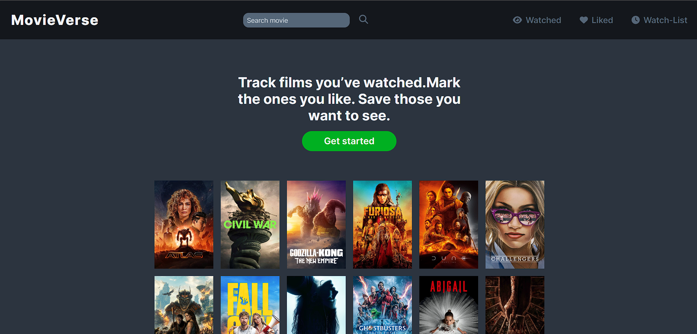

# MovieVerse

A user-friendly movie app for tracking watched, liked, and watch-list movies with an easy search feature.

You can view the project live here:
[MovieVerse](https://movieverse-react-app.netlify.app/)

### Table of Contents

- [Project-features](#project-requirements-from-the-business)
- [Technologies](#getting-started)
- [References](#references)

## Project features

- User Authentication: Secure sign-up and login functionality.
- Add Watched Movies: Easily add movies that you've already watched to your watched list.
- Add Liked Movies: Keep track of the movies you love by adding them to your liked list.
- Create a Watch-List: Save movies you want to watch later by adding them to your watch-list.
- Search Movies: Quickly find any movie by searching its name.
- User-Friendly Interface: Enjoy a clean, intuitive interface designed for ease of use.
- Seamless Navigation: Effortlessly navigate between different lists and movie details.
- Responsive Design: Accessible on various devices, ensuring a smooth experience on mobile, tablet, and desktop.
- Detailed Movie Information: View detailed information for each movie, including title, genre, and description.

## Technologies

- 👉 Routing - React Router
- 👉 Styling - Tailwind CSS
- 👉 Remote state management - React Query
- 👉 Ui state management - Redux, Redux Toolkit

## References

Inspired by the colors and stylings of Letterboxd: [Letterboxd](https://letterboxd.com/)